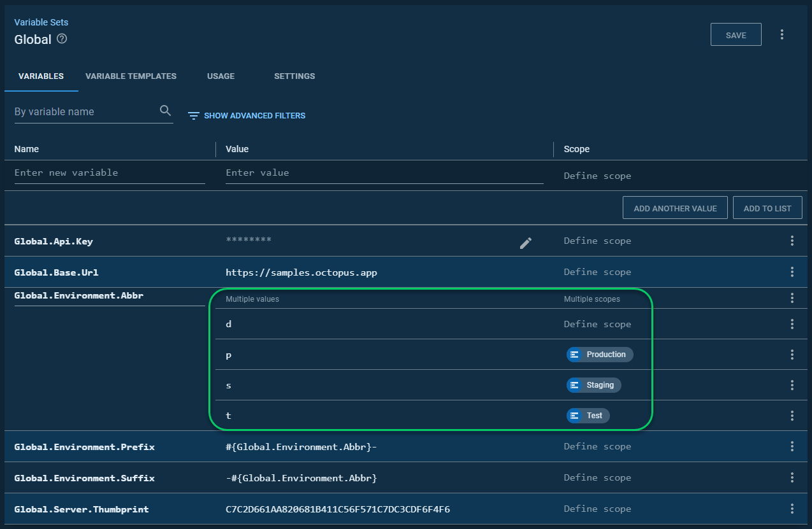
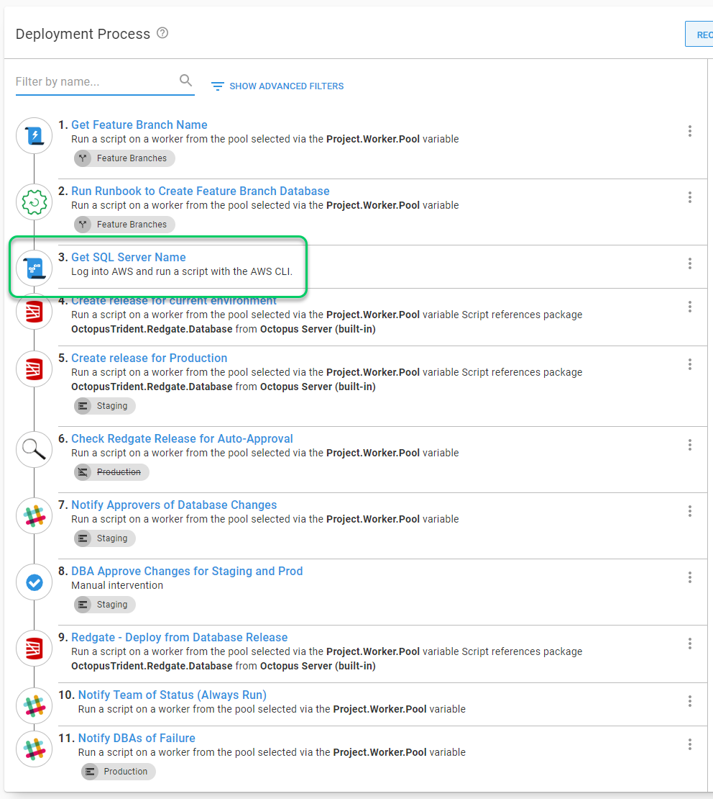
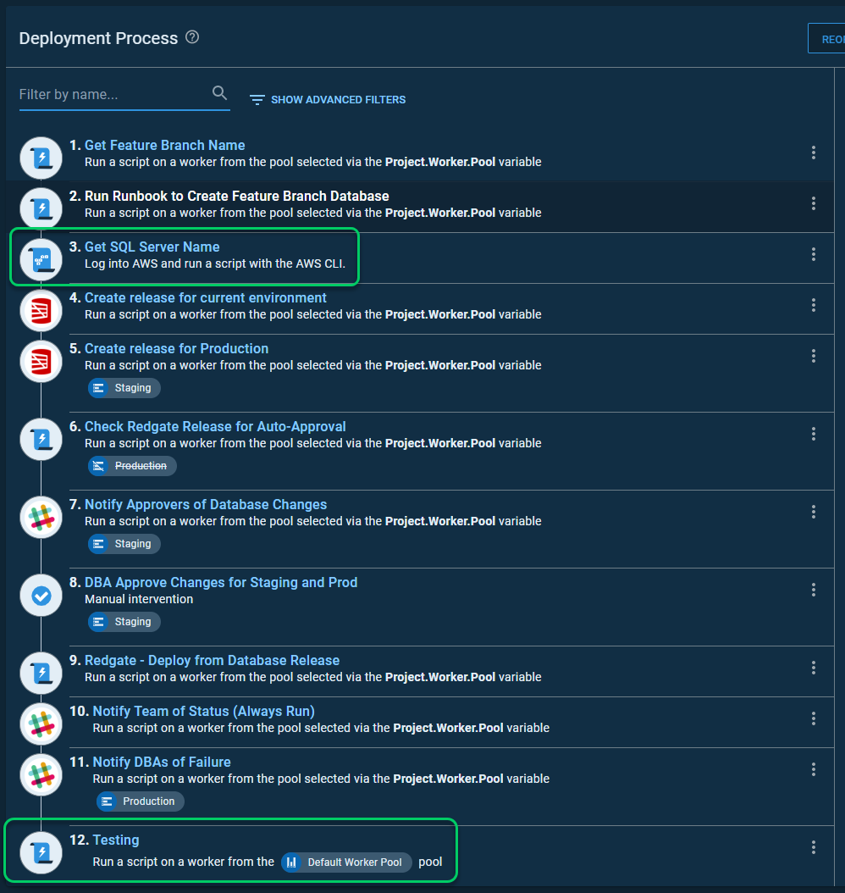

# Space Cloner
Sample script to help you clone a space.

## This cloning process is provided as is!
Please test it on an empty space before attempting to use it for any kind of real-world use.  Please clone this repo and modify the script to meet your needs.  This script should be a starting point for your process.

## Who uses this process?
This script was developed by the Customer Success team at Octopus Deploy.  We use it to clone items for our [samples instance](https://samples.octopus.app).

## Will you fix my bug?  
Submit an issue if you encounter a bug.  We will triage it and give you a decision on if it will be fixed.

What won't be fixed:
- Failures as a result of cloning from massive differences in versions, for example `3.17.14` to `2020.2.6`.  However, if it is a small difference in versions, we are much more likely to fix it.
- Certain Excluded Object Types (sensitive variables, targets, workers, etc).  They were excluded for a specific reason.  

## What about feature requests?
Unless it is something we (Customer Success) needs, we probably won't add it ourselves.  We encourage you to fork the repo, add your desired functionality.  If you think others will benefit submit a PR.

## Do you accept pull requests?
Yes!  If you want to improve this script please submit a pull request!

# Use Cases
This script was written to solve the following use cases.

- As a user I want to split my one massive default space into multiple spaces on the same instance.
- As a user I have two Octopus Deploy instances.  One for dev/test deployments.  Another for staging/prod deployments.  I have the same set of projects I want to keep in sync.
- As a user I want to clone a set of projects to a test instance to experiment with some new options.
- As a user I want to merge multiple Octopus Deploy instances into the one space on one instance (we wouldn't recommend this, but it is possible).

## Upcoming Use Cases

- As a user I have a set of "master" projects.  I clone from that project when I need to create a new project.  However, when the process on the "master" project is updated I would like to update the existing projects.

# Versions Supported

It _should_ work with any Octopus version `3.4` or higher.  It was developed by testing against a version running `2020.x`.  Take from that what you will.    

The key factor here is the difference in version between the source server and destination server.  The closer the source and destination are in versions, the better the chance for success.  Big jumps, such as going from `4.0.4` to `2020.2.6` have a small chance of success.  Small jumps, going from `2020.1` to `2020.2` have a much, much, much better chance.

This script does its best to exclude items found in newer versions of Octopus that are not in older versions.  

# How it works
You provide the a source Octopus instance space and a destination Octopus instance space.  It will hit the API of both instances and copy items from the source space into the destination space.

## What will it clone
The script `CloneSpace.ps1` will clone the following:

- Environments
- Worker Pools (not workers, just the pools)
- Project Groups
- External Feeds
- Tenant Tags
- Step Templates (both community and custom step templates)
- Accounts
- Library Variable Sets
- Lifecycles
- Projects
    - Settings
    - Deployment Process
    - Runbooks
    - Variables
- Tenants (no tenant variables)

## What won't it clone
The script `CloneSpace.ps1` will not clone the following items:
- Tenant Variables
- Script Modules (yet)
- Deployments
- Releases
- Packages
- Workers
- Targets
- Users
- Teams
- Roles
- External Auth Providers (or groups)
- Server settings like folders
- Spaces
- Project Versioning Strategy (clears out package references)
- Project Automatic Release Creation (clears out package references)

The assumption is you are using this script to clone a process to another instance for testing purposes.  You don't need the headache of deployments, releases and everything associated with it.

Tenant variables were excluded mostly due to how they are returned from the API.  Honestly it looked like a bit of a maintenance nightmare.

### No targets or workers
The majority of the use cases this script was designed for involved moving between Octopus Deploy instances.  This made targets almost impossible to bring over.

- The thumbprint on the server will be different than the tentacle is expecting.
- Polling tentacles are configured to point to a specific instance, bring over the registration won't work.
- Several targets rely on accounts (Azure Targets and K8s specifically).  The script has to enter default values for those items, meaning they won't connect.

Chances are you will want different targets per instance.  

## The Space Has to Exist
The space on the source and destination must exist prior to running the script.  The script will fail if the destination space doesn't exist.  It doesn't create a space for you.

## What it won't overwrite
This script was designed to be run multiple times with the same parameters.  It isn't useful if the script is constantly overwriting / removing values each time you run it.  It will not overwrite the following:

- Accounts (match by name)
- Feeds (match by name)
- Tenants (match by name)
- Sensitive variables (match by name)
- Community Step Templates (match by name)
- Worker Pools (match by name)
- Process steps (match by name)
- Channels (match by name)
- Project Versioning Strategy (once you set it in the destination project, it keeps it)
- Project Automatic Release Creation (once you set it in the destination project, it keeps it)

## Limitations
Because this is hitting the Octopus API (and not the database) it cannot decrypt items from the Octopus Database.  It also cannot download packages for you.

- All Sensitive Variables cloned will be set to 'Dummy Value'.
- All Accounts cloned will have dummy values for keys and ids.
- All External Feeds will have their login credentials set to `null`.
- All package references in "script steps" (AWS CLI, Run a Script, Azure CLI) in deployment process or runbook process steps will be removed.  All deployment steps with package references will remain as is.

## Simple Relationship Management
The process does not attempt to walk a tree of dependencies.  It loads up all the necessary data from the source and destination.  When it comes across an ID in the source space it will attempt to find the corresponding ID in the destination space.  If it cannot find a matching item it removes that binding.  

If that binding on a specific object is required the script will fail.  

Let's use environment scoping as the example.  In my source I have a variable set called `Global`.  That variable set has an environment scoped to environments.


In my destination space I only have three of those four environments, `Test`, `Staging`, and `Production`.  As a result, the cloned variable set still has the `Development` value but it doesn't have a scope associated with it.



## Intelligent Process Cloning
This script assumes when you clone a deployment process you want to add missing steps but leave existing steps as is.

I have a deployment process on my source where I added a new step.



My destination deployment process has a new step on the end that is not in the source.


After the sync is complete the new step was added and the additional step was left as is.



The rules for cloning a deployment process are:

- Clone steps not found in the destination process
- Leave existing steps as is
- Clear out package references when cloning new steps
- The source process is the source of truth for step order.  It will ensure the destination deployment process order matches.  It will then add additional steps found in the deployment process not found in the source to the end of the deployment process.

# Logging

This script will write to the host for you to keep track of what is going on.  It will also write to additional logs.  Each run will generate two new logs.

- CleanUpLog -> A log of items indicating what you will need to clean up
- Log -> The verbose log of the clone

The logs will be placed in the $PSScriptRoot folder.

# Parameter Reference

The script accepts the following parameters.

- SourceOctopusUrl - the base url of the source Octopus Server for example: https://samples.octopus.app.  This can be the same as the destination.
- SourceOctopusApiKey - the API key to access the source Octopus Server, user must have read permissions
- SourceSpaceName - the name of the space you wish to copy from

- DestinationOctopusUrl - the base url of the destination Octopus Server for example https://codeaperture.octopus.app.  This can be the same as the source.
- DestinationOctopusApiKey - the API key to access the destination Octopus Server, the user must have edit permissions
- DestinationSpaceName - the name of the space you wish to copy to.

- EnvironmentsToClone - Comma separated list of environments to clone.  Uses Regular expression matching.  If you supply the word "all" it will clone all environments.  Examples: "test,staging,production" or "all" or "prod*".  Default value is `null` indicating nothing will be cloned.
- WorkerPoolsToClone - Comma separated list of worker pools to clone.  It will not clone workers.  Uses Regular expression matching.  If you supply the word "all" it will clone all worker pools.  Examples: "AWS*,development worker pool" or "all" or "AWS*".  Default value is `null` indicating nothing will be cloned.
- ProjectGroupsToClone - Comma separated list of project groups to clone.  Uses Regular expression matching.  If you supply the word "all" it will clone all project groups.  Examples: "AWS*,default project group" or "all" or "AWS*".  Default value is `null` indicating nothing will be cloned.
- TenantTagsToClone - Comma separated list of tenant tags to clone.  Uses Regular expression matching.  If you supply the word "all" it will clone all tenant tags.  Examples: "AWS*,my tag" or "all" or "AWS*".  Default value is `null` indicating nothing will be cloned.
- ExternalFeedsToClone - Comma separated list of external feeds to clone.  Uses Regular expression matching.  If you supply the word "all" it will clone all external feeds.  Examples: "AWS*,docker hub" or "all" or "AWS*".  Default value is `null` indicating nothing will be cloned.
- StepTemplatesToClone - Comma separated list of step templates to clone.  Uses Regular expression matching.  If you supply the word "all" it will clone all step templates.  Examples: "AWS*,SQL Server*" or "all" or "AWS*".  Default value is `null` indicating nothing will be cloned.
- InfrastructureAccountsToClone - Comma separated list of accounts feeds to clone.  Uses Regular expression matching.  If you supply the word "all" it will clone all accounts.  Examples: "AWS*,Azure*" or "all" or "AWS*".  Default value is `null` indicating nothing will be cloned.
- LibraryVariableSetsToClone - Comma separated list of library variable sets to clone.  Uses Regular expression matching.  If you supply the word "all" it will clone all variable sets.  Examples: "AWS*,Global" or "all" or "AWS*".  Default value is `null` indicating nothing will be cloned.
- LifeCyclesToClone - Comma separated list of lifecycles to clone.  Uses Regular expression matching.  If you supply the word "all" it will clone all lifecycles.  Examples: "AWS*,Default" or "all" or "AWS*".  Default value is `null` indicating nothing will be cloned.
- ProjectsToClone - Comma separated list of projects to clone.  Uses Regular expression matching.  If you supply the word "all" it will clone all projects.  Examples: "AWS*,SQL Server" or "all" or "AWS*".  Default value is `null` indicating nothing will be cloned.  This will not clone releases or deployments.
- TenantsToClone - Comma separated list of tenants to clone.  Uses Regular expression matching.  If you supply the word "all" it will clone all tenants.  Examples: "AWS*,internal" or "all" or "AWS*".  Default value is `null` indicating nothing will be cloned.
- OverwriteExistingCustomStepTemplates - Indicates if existing custom step templates (not community step templates) should be overwritten.  Useful when you make a change to a step template you want to move over to another instance.  Possible values are `true` or `false`.  Defaults to `false`.
- OverwriteExistingLifecyclesPhases - Indicates you want to overwrite the phases on existing lifecycles.  This is useful when you have an updated lifecycle you want applied to applied to another space/instance.  You would want to leave this to false if the destination lifecycle has different phases.  Possible values are `true` or `false`.  Defaults to `false`.
- OverwriteExistingVariables - Indicates if all existing variables (except sensitive variables) should be overwritten.  Possible values are `true` or `false`.  Defaults to `false`.
- AddAdditionalVariableValuesOnExistingVariableSets - Indicates a variable on the destination should only have one value.  You would have multiple values if you were scoping variables.  Possible values are `true` or `false`.  Defaults to `false`.

## AddAdditionalVariableValuesOnExistingVariableSets further detail

On your source you have a variable set with the following values:


On your destination space you have the same variable set with the following values:


When the variable `AddAdditionalVariableValuesOnExistingVariableSets` is set to `True` it will add that missing value.

When the variable `AddAdditionalVariableValuesOnExistingVariableSets` is set to `False` it will not add that missing value.

## Examples

All these examples are for the [Target - SQL Server Space](https://samples.octopus.app/app#/Spaces-106) on the samples instance.

### Clone Everything
Set everything to all.  `All` is special keyword for the script.  When it sees that it will grab everything.

```
CloneSpace.ps1 -SourceOctopusUrl "https://samples.octopus.app" -SourceOctopusApiKey "SOME KEY" -SourceSpaceName "Target - SQL Server" -DestinationOctopusUrl "https://myinstance.octopus" -DestinationOctopusApiKey "My Key" -DestinationSpace Name "Demo Clone" -EnvironmentsToClone "all" -WorkerPoolsToClone "all" -ProjectGroupsToClone "all" -TenantTagsToClone "all" -ExternalFeedsToClone "all" -StepTemplatesToClone "all" -InfrastructureAccountsToClone "all" -LibraryVariableSetsToClone "all" -LifeCyclesToClone "all" -ProjectsToClone "all" -TenantsToClone "all" -OverwriteExistingVariables "True" -OneInstanceOfVariableAllowedOnDestination "False" -OverwriteExistingCustomStepTemplates "True" -OverwriteExistingLifecyclesPhases "True"
```

### Clone project and associated dependencies
You have to know the dependencies of the project, the script won't do the work for you.  This script can be run multiple times and it will only copy over differences it finds.

```
CloneSpace.ps1 -SourceOctopusUrl "https://samples.octopus.app" -SourceOctopusApiKey "SOME KEY" -SourceSpaceName "Target - SQL Server" -DestinationOctopusUrl "https://myinstance.octopus" -DestinationOctopusApiKey "My Key" -DestinationSpace Name "Demo Clone" -EnvironmentsToClone "test,staging,production" -WorkerPoolsToClone "AWS*" -ProjectGroupsToClone "all" -TenantTagsToClone "all" -ExternalFeedsToClone "all" -StepTemplatesToClone "all" -InfrastructureAccountsToClone "AWS*" -LibraryVariableSetsToClone "AWS*,Global,Notification,SQL Server" -LifeCyclesToClone "AWS*" -ProjectsToClone "Redgate - Feature Branch Example" -TenantsToClone "all" -OverwriteExistingVariables "false" -OneInstanceOfVariableAllowedOnDestination "False" -OverwriteExistingCustomStepTemplates "false" -OverwriteExistingLifecyclesPhases "false"
```

### Clone specific project(s)
If all you want to do is clone a specific project without worrying about dependencies you could do this.  It will ensure all the steps and variables and channels from the source project appear in the destination project.  It won't overwrite existing values.

```
CloneSpace.ps1 -SourceOctopusUrl "https://samples.octopus.app" -SourceOctopusApiKey "SOME KEY" -SourceSpaceName "Target - SQL Server" -DestinationOctopusUrl "https://myinstance.octopus" -DestinationOctopusApiKey "My Key" -DestinationSpace Name "Demo Clone" -ProjectsToClone "Redgate - Feature Branch Example,Redgate - Simple Deployment"
```

# Debugging

This is a script manipulating data and then calling an API, it is possible it will send a bad JSON body up to the API.  

All JSON requests are stored in the log.  For example:

```
Going to invoke POST https://code-aperture.octopus.app/api/Spaces-104/Environments with the following body
{
    "Id":  null,
    "Name":  "Test",
    "Description":  "",
    "SortOrder":  1,
    "UseGuidedFailure":  false,
    "AllowDynamicInfrastructure":  false,
    "SpaceId":  "Spaces-104",
    "ExtensionSettings":  [
                              {
                                  "ExtensionId":  "issuetracker-jira",
                                  "Values":  {

                                             }
                              }
                          ],
    "Links":  {
                  "Self":  "/api/Spaces-106/environments/Environments-111",
                  "Machines":  "/api/Spaces-106/environments/Environments-111/machines{?skip,take,partialName,roles,isDisabled,healthStatuses,commStyles,tenantIds,tenantTags,shellNames}",
                  "SinglyScopedVariableDetails":  "/api/Spaces-106/environments/Environments-111/singlyScopedVariableDetails",
                  "Metadata":  "/api/Spaces-106/environments/Environments-111/metadata"
              }
}
```

You can copy that body and URL into Postman to manipulate until it works for you.  Once you know the cause you can update the script to make sure it doesn't happen again.