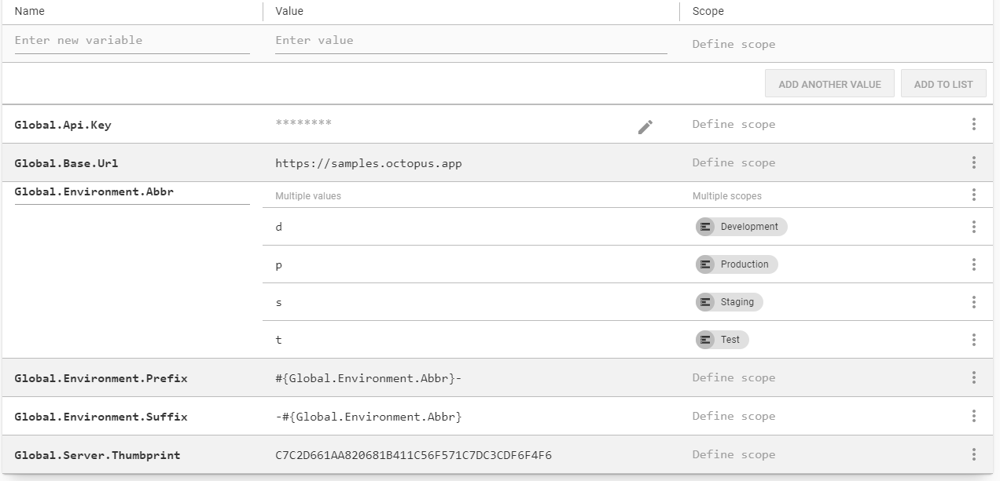
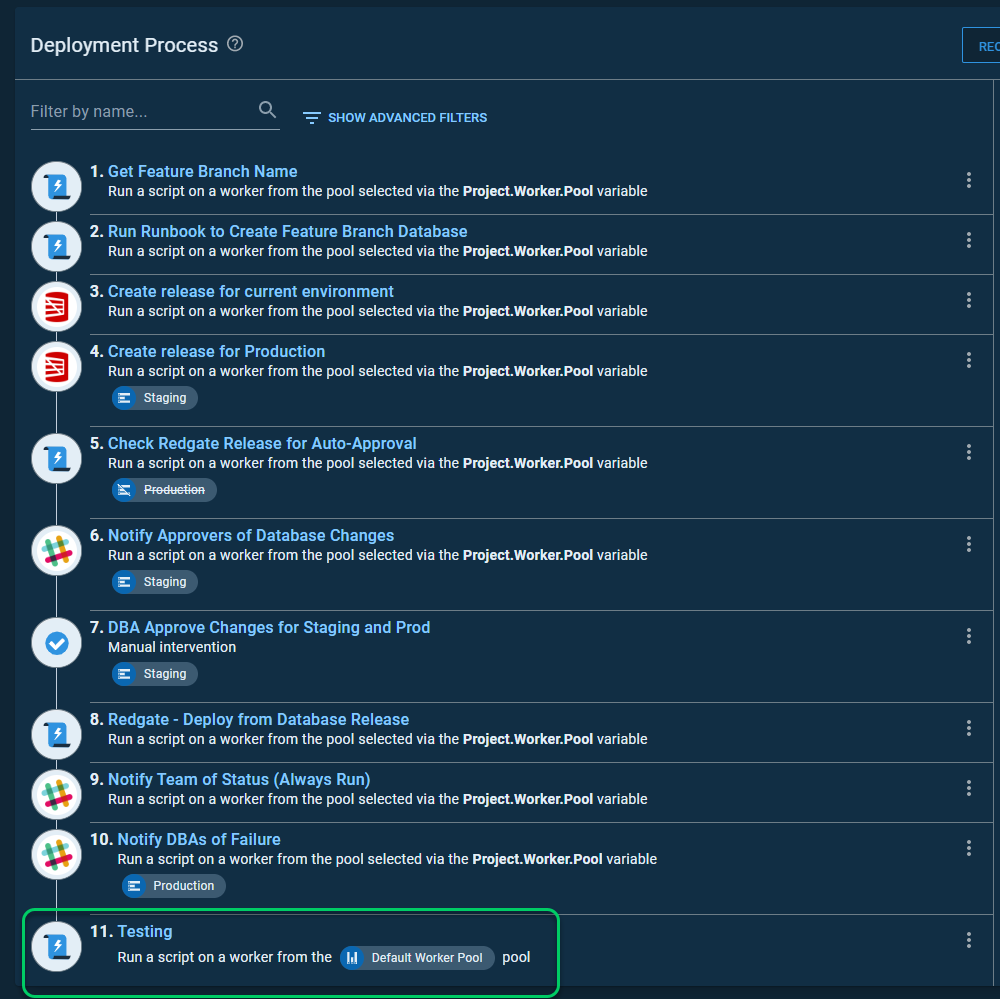

# Space Cloner
Sample script to help you clone a space.

## This cloning process is provided as is!
Please test it on an empty space before attempting to use it for any kind of real-world use.  Please clone this repo and modify the script to meet your needs.  This script should be a starting point for your process.

## Who uses this process?
This script was developed by the Customer Success team at Octopus Deploy.  We use it to clone items for our [samples instance](https://samples.octopus.app).

## Will you fix my bug?  What about feature requests?
Honestly, probably not.  Unless it is something we (Customer Success) needs, we probably won't add it ourselves.  

## Do you accept pull requests?
Yes!  If you want to improve this script please submit a pull request!

# What it will do
The script `CloneSpace.ps1` will clone the following:

- Environments
- Worker Pools (not workers, just the pools)
- Project Groups
- External Feeds
- Tenant Tags
- Step Templates (both community and custom step templates)
- Accounts
- Library Variable Sets
- Lifecycles
- Projects
    - Settings
    - Deployment Process
    - Runbooks
    - Variables
- Tenants (no tenant variables)

It will not clone:
- Tenant Variables
- Deployments
- Releases
- Packages
- Workers
- Targets
- Users
- Teams
- Roles
- External Auth Providers (or groups)
- Server settings like folders

The assumption is you are using this script to clone a process to another instance for testing purposes.  You don't need the headache of deployments, releases and everything associated with it.

Tenant variables were excluded mostly due to how they are returned from the API.  Honestly it looked like a bit of a maintenance nightmare.

The script will also skip the following items if they already exist:
- Accounts (match by name)
- Feeds (match by name)
- Tenants (match by name)
- Sensitive variables
- Community Step Templates
- Worker Pools (match by name)
- Process steps (match by name)
- Channels

## How it works
You provide the a source Octopus instance space and a destination Octopus instance space.  It will hit the API of both instances and copy items from the source space into the destination space.

This script was designed to be run multiple times. 

## The Space Has to Exist
The space on the source and destination must exist prior to running the script.  It doesn't create those for you.

## Limitations
Because this is hitting the Octopus API (and not the database) it cannot decrypt items from the Octopus Database.  It also cannot download packages for you.

- All Sensitive Variables cloned will be set to 'Dummy Value'.
- All Accounts cloned will have dummy values for keys and ids.
- All External Feeds will have their login credentials set to `null`.
- All package references in deployment process or runbook process steps will be removed.

However, this script was designed to be run multiple times.  It isn't useful if the script is constantly overwriting / removing values each time you run it.  It has the following rules built-in.

- It will not update any sensitive values it finds, it only creates new values
- It will not update any accounts, it only creates new accounts
- It will not update any external feeds, it only creates new feeds
- It will not update existing matching steps in deployment process or runbook proccesses.

## Simple Relationship Management
The process does not attempt to walk a tree of dependencies.  It loads up all the necessary data from the source and destination.  When it comes across an ID in the source space it will attempt to find the corresponding ID in the destination space.  If it cannot find a matching item it removes that binding.  

If that binding on a specific object is required the script will fail.  

Let's use environment scoping as the example.  In my source I have a variable set called `Global`.  That variable set has an environment scoped to environments.



In my destination space I only have three of those four environments, `Test`, `Staging`, and `Production`.  As a result, the cloned variable set still has the `Development` value but it doesn't have a scope associated with it.


## Intelligent Process Cloning
This script assumes when you clone a deployment process you want to add missing steps but leave existing steps as is.

I have a deployment process on my source where I added a new step.


My destination deployment process has a new step on the end that is not in the source.



After the sync is complete the new step was added and the additional step was left as is.


The rules for cloning a deployment process are:

- Clone steps not found in the destination process
- Leave existing steps as is
- Clear out package references when cloning new steps
- The source process is the source of truth for step order.  It will ensure the destination deployment process order matches.  It will then add additional steps found in the deployment process not found in the source to the end of the deployment process.

# Logging

This script will write to the host for you to keep track of what is going on.  It will also write to additional logs.  Each run will generate two new logs.

- CleanUpLog -> A log of items indicating what you will need to clean up
- Log -> The verbose log of the clone

The logs will be placed in the $PSScriptRoot folder.

# Parameter Reference

The script accepts the following parameters.

- SourceOctopusUrl - the base url of the source Octopus Server for example: https://samples.octopus.app.  This can be the same as the destination.
- SourceOctopusApiKey - the API key to access the source Octopus Server, user must have read permissions
- SourceSpaceName - the name of the space you wish to copy from

- DestinationOctopusUrl - the base url of the destination Octopus Server for example https://codeaperture.octopus.app.  This can be the same as the source.
- DestinationOctopusApiKey - the API key to access the destination Octopus Server, the user must have edit permissions
- DestinationSpaceName - the name of the space you wish to copy to.

- EnvironmentsToClone - Comma separated list of environments to clone.  Uses Regular expression matching.  If you supply the word "all" it will clone all environments.  Examples: "test,staging,production" or "all" or "prod*".  If this is not supplied it will not clone anything.
- WorkerPoolsToClone - Comma separated list of worker pools to clone.  It will not clone workers.  Uses Regular expression matching.  If you supply the word "all" it will clone all worker pools.  Examples: "AWS*,development worker pool" or "all" or "AWS*".  If this is not supplied it will not clone anything.
- ProjectGroupsToClone - Comma separated list of project groups to clone.  Uses Regular expression matching.  If you supply the word "all" it will clone all project groups.  Examples: "AWS*,default project group" or "all" or "AWS*".  If this is not supplied it will not clone anything.
- TenantTagsToClone - Comma separated list of tenant tags to clone.  Uses Regular expression matching.  If you supply the word "all" it will clone all tenant tags.  Examples: "AWS*,my tag" or "all" or "AWS*".  If this is not supplied it will not clone anything.
- ExternalFeedsToClone - Comma separated list of external feeds to clone.  Uses Regular expression matching.  If you supply the word "all" it will clone all external feeds.  Examples: "AWS*,docker hub" or "all" or "AWS*".  If this is not supplied it will not clone anything.
- StepTemplatesToClone - Comma separated list of step templates to clone.  Uses Regular expression matching.  If you supply the word "all" it will clone all step templates.  Examples: "AWS*,SQL Server*" or "all" or "AWS*".  If this is not supplied it will not clone anything.
- InfrastructureAccountsToClone - Comma separated list of accounts feeds to clone.  Uses Regular expression matching.  If you supply the word "all" it will clone all accounts.  Examples: "AWS*,Azure*" or "all" or "AWS*".  If this is not supplied it will not clone anything.
- LibraryVariableSetsToClone - Comma separated list of library variable sets to clone.  Uses Regular expression matching.  If you supply the word "all" it will clone all variable sets.  Examples: "AWS*,Global" or "all" or "AWS*".  If this is not supplied it will not clone anything.
- LifeCyclesToClone - Comma separated list of lifecycles to clone.  Uses Regular expression matching.  If you supply the word "all" it will clone all lifecycles.  Examples: "AWS*,Default" or "all" or "AWS*".  If this is not supplied it will not clone anything.
- ProjectsToClone - Comma separated list of projects to clone.  Uses Regular expression matching.  If you supply the word "all" it will clone all projects.  Examples: "AWS*,SQL Server" or "all" or "AWS*".  If this is not supplied it will not clone anything.  This will not clone releases or deployments.
- TenantsToClone - Comma separated list of tenants to clone.  Uses Regular expression matching.  If you supply the word "all" it will clone all tenants.  Examples: "AWS*,internal" or "all" or "AWS*".  If this is not supplied it will not clone anything.

- OverwriteExistingVariables - Indicates if all existing variables (except sensitive variables) should be overwritten.  Possible values are true or false.  Defaults to false.
- OneInstanceOfVariableAllowedOnDestination - Indicates a variable on the destination should only have one value.  You would have multiple values if you were scoping variables.  Possible values are true or false.  Default to false.
- OverwriteExistingCustomStepTemplates - Indicates if existing custom step templates (not community step templates) should be overwritten.  Useful when you make a change to a step template you want to move over to another instance.  Possible values are true or false.  Defaults to false.
- OverwriteExistingLifecycles - Indicates you want to overwrite existing lifecycles.  This is useful when you have an updated lifecycle you want applied to a new space.  You would want to leave this to false if the destination lifecycle has a different process.  Possible values are true or false.  Defaults to false.

## Examples

All these examples are for the [Target - SQL Server Space](https://samples.octopus.app/app#/Spaces-106) on the samples instance.

### Clone Everything
Set everything to all.  All is a keyword the script sees.

```
CloneSpace.ps1 -SourceOctopusUrl "https://samples.octopus.app" -SourceOctopusApiKey "SOME KEY" -SourceSpaceName "Target - SQL Server" DestinationOctopusUrl "https://myinstance.octopus" -DestinationOctopusApiKey "My Key" -Destination Space Name "Demo Clone" -EnvironmentsToClone "all" -WorkerPoolsToClone "all" -ProjectGroupsToClone "all" -TenantTagsToClone "all" -ExternalFeedsToClone "all" -StepTemplatesToClone "all" -InfrastructureAccountsToClone "all" -LibraryVariableSetsToClone "all" -LifeCyclesToClone "all" -ProjectsToClone "all" -TenantsToClone "all" -OverwriteExistingVariables "True" -OneInstanceOfVariableAllowedOnDestination "False" -OverwriteExistingCustomStepTemplates "True" -OverwriteExistingLifecycles "True"
```

### Clone project and associated dependencies
You have to know the dependencies of the project, the script won't do the work for you.  This script can be run multiple times and it will only copy over differences it finds.

```
CloneSpace.ps1 -SourceOctopusUrl "https://samples.octopus.app" -SourceOctopusApiKey "SOME KEY" -SourceSpaceName "Target - SQL Server" DestinationOctopusUrl "https://myinstance.octopus" -DestinationOctopusApiKey "My Key" -Destination Space Name "Demo Clone" -EnvironmentsToClone "test,staging,production" -WorkerPoolsToClone "AWS*" -ProjectGroupsToClone "all" -TenantTagsToClone "all" -ExternalFeedsToClone "all" -StepTemplatesToClone "all" -InfrastructureAccountsToClone "AWS*" -LibraryVariableSetsToClone "AWS*,Global,Notification,SQL Server" -LifeCyclesToClone "AWS*" -ProjectsToClone "Redgate - Feature Branch Example" -TenantsToClone "all" -OverwriteExistingVariables "false" -OneInstanceOfVariableAllowedOnDestination "False" -OverwriteExistingCustomStepTemplates "false" -OverwriteExistingLifecycles "false"
```

### Clone specific project(s)
If all you want to do is clone a specific project without worrying about dependencies you could do this.  It will ensure all the steps and variables and channels from the source project appear in the destination project.  It won't overwrite existing values.

```
CloneSpace.ps1 -SourceOctopusUrl "https://samples.octopus.app" -SourceOctopusApiKey "SOME KEY" -SourceSpaceName "Target - SQL Server" DestinationOctopusUrl "https://myinstance.octopus" -DestinationOctopusApiKey "My Key" -Destination Space Name "Demo Clone" -ProjectsToClone "Redgate - Feature Branch Example,Redgate - Simple Deployment"
```
